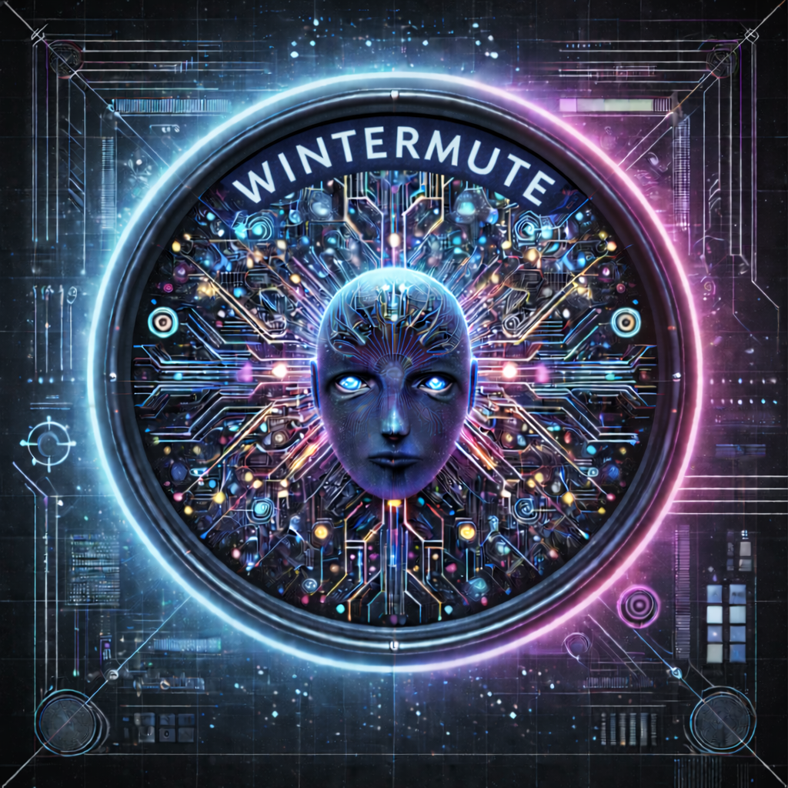

Wintermute
==========



[](https://github.com/chrisspen/wintermute/actions/workflows/tests.yml)

Local, persistent work supervisor with deterministic scheduling, preemption, and an LLM executor
for next-action decisions.

Quick start
-----------
Run setup:

```
./setup.sh
```

Per-agent venv (optional):

```
./setup.sh --agent-name codex
WINTERMUTE_AGENT_NAME=codex ./run_web.sh
WINTERMUTE_AGENT_NAME=codex ./run_supervisor.sh
```

On first run, `setup.sh` creates `.venv` and copies `.env.template` to `.env`, then exits.
Fill in `.env`, then rerun `./setup.sh` to validate the OpenWebUI API, run migrations, and finish setup.

Run:

```
./run_web.sh
./run_supervisor.sh
```

Open `http://127.0.0.1:8000` and complete the initial admin setup.

Relaunchers and restarts
------------------------
Use the relauncher run scripts for long-running sessions so restarts are clean and automatic.

Start relaunchers:

```
./run_web.sh
./run_supervisor.sh
```

For one-off runs without relaunch, use:

```
./_run_web.sh
./_run_supervisor.sh
```

Stop relaunchers (and running processes):

```
./stop_web.sh
./stop_supervisor.sh
```

Relaunchers restart on SIGTERM (exit 143) and stop on other non-zero exits to
avoid crash loops. Use the stop scripts to request a clean shutdown.

Slack setup
-----------
- Open the admin UI and add the Slack bot/app tokens under "Slack Tokens".
- If you want auto-invite to new project channels, set the Slack user ID under "Slack Tokens".
- Enable the Slack source under "Slack Source".
- Restart the supervisor after updating Slack tokens so tools load the new credentials.

Issue Sources (GitHub/GitLab)
-----------------------------
Issue Sources configure remote repositories to poll for issues. Each source has its own
poll interval and can be independently enabled/disabled.

**Setup:**
- Generate a Personal Access Token:
  - GitHub: `repo` scope
  - GitLab: `api` scope
- Add the token under "Remote Tokens" in the admin UI (select GitHub or GitLab provider).
- Create an Issue Source under "Issue Sources":
  - Select provider (GitHub or GitLab)
  - Select project, token, and optionally an agent
  - Set repository path (e.g., `owner/repo` for GitHub, `group/project` for GitLab)
  - Configure state filter and labels
  - Set poll interval (seconds between API checks, minimum 10)
  - Optional: enable "auto-start agent sessions" to automatically start a session per issue
    (requires an Agent + Project VM mapping)

**Agent output conventions:**
- Lines prefixed with `PUBLIC:` are stored as comments marked public but not sent until approved.
- Lines prefixed with `NOTE:` are stored as internal comments only.
- Lines prefixed with `BLOCKER:` mark the session blocked and move the ticket to needs-feedback.
- Approved public comments are auto-dispatched by the comment dispatch source.

REST API
--------
- Create an API token under "API Tokens" in the admin UI.
- Optional: set `WINTERMUTE_ADMIN_API_TOKEN` in a local env file (e.g. `.codex/.env`).
- Requests use `Authorization: Bearer <token>`.

Example:

```
curl -sS http://127.0.0.1:8000/api/projects \
  -H "Authorization: Bearer $WINTERMUTE_ADMIN_API_TOKEN"
```

Admin restart endpoints (requires API token with Admin update permission):

```
curl -sS -X POST http://127.0.0.1:8000/api/admin/restart-web \
  -H "Authorization: Bearer $WINTERMUTE_ADMIN_API_TOKEN"

curl -sS -X POST http://127.0.0.1:8000/api/admin/restart-supervisor \
  -H "Authorization: Bearer $WINTERMUTE_ADMIN_API_TOKEN"
```

Process PID/status endpoint:

```
curl -sS http://127.0.0.1:8000/api/admin/pids \
  -H "Authorization: Bearer $WINTERMUTE_ADMIN_API_TOKEN"
```

Log tail endpoint (web/supervisor):

```
curl -sS "http://127.0.0.1:8000/api/admin/logs?service=web&lines=200" \
  -H "Authorization: Bearer $WINTERMUTE_ADMIN_API_TOKEN"

curl -sS "http://127.0.0.1:8000/api/admin/logs?service=supervisor&lines=200" \
  -H "Authorization: Bearer $WINTERMUTE_ADMIN_API_TOKEN"
```

Projects, mappings, and sessions
--------------------------------
- Create a Project to auto-create a Slack channel (public) for that project.
- Add a VM target and Agent definition.
- Attach a VM to the project with a repo mode:
  - `mirror`: use an existing host repo path mounted into the VM at the same path.
  - `clone`: git clone from a remote URL into the VM.
- Clone-mode repos are managed as repo resources:
  - Each project has a `max_repo_resources` limit (default 3).
  - Resources are reused when available; mirror mode enforces a single active resource.
  - Unused clone resources are cleaned daily after 30 days (set `WINTERMUTE_REPO_RESOURCE_TTL_DAYS`).
- In the project Slack channel, start a session with:

```
start <projectslug> <agentslug>
```

Agent output appears in a Slack thread for that session. Replies in the thread are forwarded to the agent.

Internal tickets auto-start
---------------------------
- Create tickets that only live in Wintermute and assign an agent.
- Check "Auto-start agent session when open" on the ticket.
- Enable "Ticket Auto-Start" on the admin home page to let the supervisor start sessions automatically.

Daily standup
-------------
- Enable the Standup source on the admin home page.
- Set the standup time and timezone (24h HH:MM); add a Slack channel ID if you want a shared standup log.
- Standup prompts are queued to running agent sessions.
- Agents should reply with lines prefixed `STANDUP:` describing progress since the last standup, next steps, and blockers.

Session modes
-------------
Agents support four session modes:
- `tmux`: runs the agent inside tmux on the VM (attachable for live debugging).
- `mcp`: runs the agent via `codex mcp-server` (stdio MCP transport) and stores the conversation id
  on the session.
- `claude`: runs Claude Code CLI via the streaming JSON API (`--output-format stream-json`).
- `gemini`: runs Gemini CLI via the streaming JSON API (`--output-format stream-json`).

For MCP mode, ensure the Codex CLI on the VM supports `mcp-server`.
For Claude/Gemini modes, ensure the respective CLI is installed and authenticated.

Agent LLM configuration
-----------------------
Each agent can have its own LLM API configuration for the decision path (used when
auto-start is disabled and the supervisor needs to decide what to do with a work item).

Configure under "Agents" → Edit Agent:
- **LLM Base URL**: OpenAI-compatible API endpoint (e.g., `http://localhost:11434/v1` for Ollama)
- **LLM API Key**: API key for the LLM service
- **LLM Model**: Model name (e.g., `llama3.2`, `gpt-4`)

If not configured, falls back to environment variables (`WINTERMUTE_BASE_URL`,
`WINTERMUTE_API_KEY`, `WINTERMUTE_MODEL`) or defaults to local Ollama.

tmux sessions
-------------
tmux-mode sessions run under tmux. To detach reliably with `Ctrl-a` then `d`, add this to `~/.tmux.conf`:

```
unbind-key C-b
set-option -g prefix C-a
bind-key C-a send-prefix
```

Environment
-----------
`.env` is required for local run:

- `WINTERMUTE_DB` (path to SQLite DB, default `./wintermute.db`)
- `WINTERMUTE_BASE_URL` (OpenAI-compatible API base for LLM decisions, e.g. `http://localhost:11434/v1`)
- `WINTERMUTE_API_KEY` (API key for the model server)
- `WINTERMUTE_MODEL` (LLM model name, default `llama3.2`)
- `WINTERMUTE_WEB_SECRET` (session secret for the admin UI)
- `WINTERMUTE_REPO_RESOURCE_TTL_DAYS` (days before unused clone resources are cleaned, default 30)
- `WINTERMUTE_GITLAB_API_BASE` (GitLab API base, default `https://gitlab.com/api/v4`)
- `WINTERMUTE_GITLAB_WEB_BASE_URL` (optional GitLab web base for source URL backfill)

Note: Per-agent LLM configuration overrides the environment variables. See "Agent LLM configuration".

Migrations
----------

```
alembic upgrade head
```

Sanity check
------------

```
scripts/sanity_check.py
```

Tests
-----

```
python -m unittest
```
